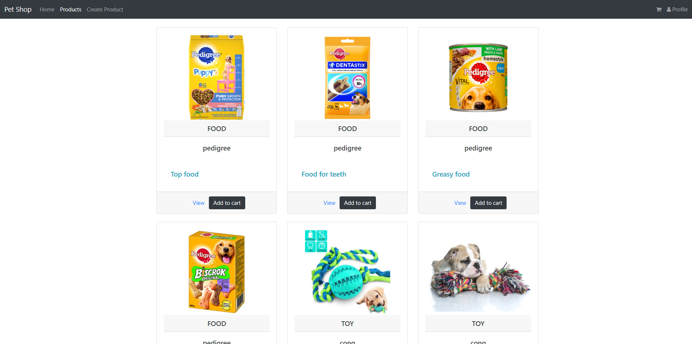
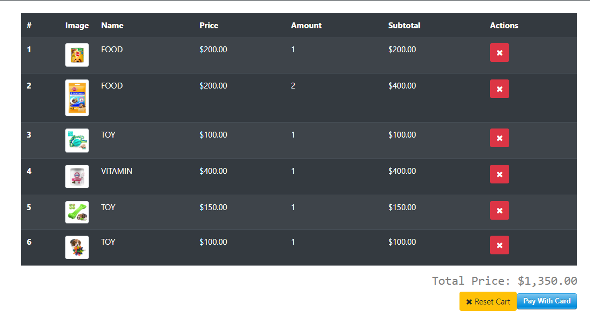
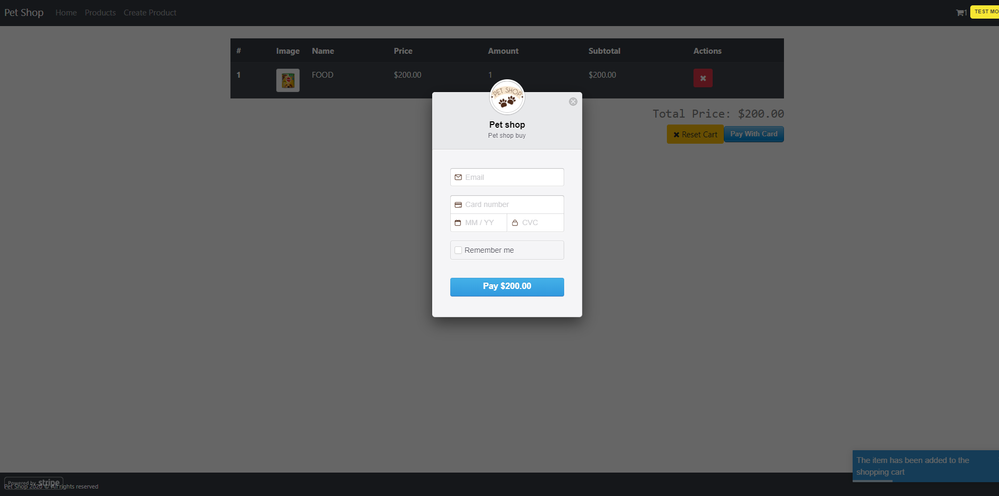
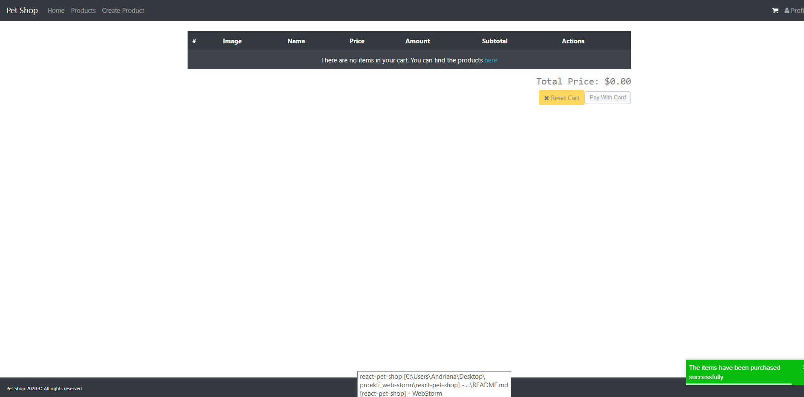

## Andriana Ilievska 163250
## Project for the Course: "Web Programming" - Faculty of Computer Science and Engineering (FINKI).

### Project info
This application is created in order to emulate a shopping website dedicated to animals, but because of the way it's being built, it can be used as an e-shop for everything.

### Startup
#### Frontend (https://github.com/Andriana95/pet-shop-react)
To start the frontend application, please open a terminal and write `npm run start`.
#### Backend (https://github.com/Andriana95/PetShop)
In order to start the application, you need to provide correct datasource information.
This is done in the `application.properties` file.

The current db is named `petShop`.

### Example:
```
spring.datasource.url=jdbc:postgresql://localhost:5432/petShop
spring.datasource.username=postgres
spring.datasource.password=admin
```
The application uses `spring.jpa.hibernate.ddl-auto=update` so that the tables will be created automatically from the domain models.

After the correct information is added, please run `DemoApplication.java`


### Pet shop Frontend
This application is used by the pet shop backend application (https://github.com/Andriana95/PetShop)

### Additional info 
This application runs on port 3000, and access to the backend is requested on port 8080 (added in `src/custom-axious/axios.js`).
If we want to run a different configuration, we need to change these settings

Stripe details: in order for stripe to always work, use these card details:
```
cardNumber: 4242 4242 4242 4242
expiry: 02/24
CVC: 222
```
Stripe's publishable key that's used can be found in `components/checkout/checkout.js:84`;

### Application details
The main application routes are:
* /home -> Entry component, shows simulated recommendations and some chart data (`Chart.js`)
* /products -> Shows the products, allows viewing details or adding to card
* /products/:id -> Shows details for the product, after fetching the productId from the route
* /products/create -> Form for creating the product
* /checkout -> Form for buying the items in the cart (uses Stripe)


### Stripe usage
Stripe is used in the checkout flow or the application. We select all of the items in the card and when the user
wants to checkout, we sum their prices by the amount and send the value to Stripe.

We then need to authenticate via Stripe's test component which allows us to enter an email.

When we submit, Stripe will return us a Checkout token which we will use along with the products and send it to the Backend so that it may create the Charge.

When everything finishes, we are returned with the order details and we show a success Toast message


### Project images







